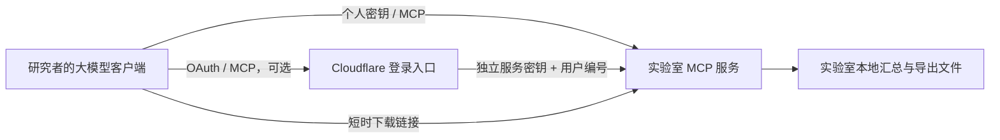

# DigitalBrain MCP 交付包

让研究者在支持 MCP 的大模型客户端中，查询 DigitalBrain 数据目录、脑区概况、基因表达汇总和证据，并下载已批准的结果。**数据和查询服务由卢萌团队自己部署；本仓库提供可修改的接口代码、Docker 部署和可选的 Cloudflare 登录入口。**

这是独立集成项目，不是 DigitalBrain 官方产品，也未声称获得团队背书。不包含原始单细胞矩阵、论文附件、模型权重或官网数据副本。

**首次阅读：[给卢萌团队的说明](docs/HANDOFF.zh-CN.md)** · [验证记录](docs/VALIDATION.zh-CN.md) · [数据接入格式](docs/DATA-CONTRACT.zh-CN.md) · [Cloudflare 部署](docs/CLOUDFLARE.zh-CN.md)

## 已完成什么

- 6 个只读工具，严格检查参数，保留来源、数据版本、范围和缺失值。
- 实验室服务器直接提供 MCP，或者 Cloudflare OAuth 登录后转发到实验室。
- 独立用户密钥、立即撤销、每天配额、30 天元数据审计记录。
- 5 分钟下载链接，绑定用户和数据版本；每次下载校验 SHA-256。
- 官网真实样本：109 条目录记录、3 个脑区概况、ASIC2/AKT2 共 648 条表达记录。已通过实际 MCP 调用与官网 JSON 数值核对，详见验证记录。
- Docker、自动检查、取样脚本、数据检查脚本与中文交接说明。

## 十分钟本地运行

需要 Node.js 22.22、npm、curl；Docker 方式还需要 Docker Engine 和 Compose v2。这里的步骤只在本机启动，不开放到公网。

```bash
git clone https://github.com/duanyu119/digitalbrain-mcp-kit.git
cd digitalbrain-mcp-kit
npm ci --legacy-peer-deps --ignore-scripts
npm run init
npm run sample
docker compose up --build -d --wait
npm run validate
```

`sample` 只按官网当前公开入口取一个小样本，保存在被 Git 忽略的 `.local-data` 目录。默认复用缓存；遇到限额或入口变化会停止，不尝试绕过。源码包里没有这批数据。没有官网网络访问时，用 `npm run fixture`，再以 `DATA_PATH=./.local-data/fixture docker compose up --build -d --wait` 运行合成测试；合成数据没有生物学含义。

不使用 Docker 时，完成前四条命令和 `npm run sample` 后执行 `npm start`。默认地址是 `http://localhost:8787/mcp`。测试另开一个终端运行 `npm run validate`。

若 8787 已被占用，可用 `LOCAL_PORT=8795 PUBLIC_ORIGIN=http://localhost:8795 docker compose up --build -d --wait`，测试时加 `TEST_ORIGIN=http://localhost:8795`。原生 Node 方式同时设置 `PORT=8795`。

客户端选择 Streamable HTTP，添加上述 `/mcp` 地址，以 `Authorization: Bearer <个人密钥>` 连接。初始个人密钥写入 `.local-data/auth/researcher.key`；仅在客户端的密钥设置中使用，不贴进聊天。只支持 OAuth 登录的客户端，使用 [Cloudflare 路径](docs/CLOUDFLARE.zh-CN.md)。不同客户端界面有差异，本次验证使用官方 MCP SDK，未宣称逐个验证所有桌面客户端。

## 可以怎样提问

| 研究者的问题 | 工具与范围 |
| --- | --- |
| “查找与海马相关的数据集，列出来源。” | `search_datasets` 搜目录；元数据不完整的记录可能不会命中过滤条件。 |
| “这个数据集包含多少细胞和供体？” | `get_dataset_info`；没有的字段返回 null。 |
| “查看 M1C 脑区概况，说明统计来自哪个数据集。” | `get_region_profile`；本次样本来自 Collection-19 / All_neurons。 |
| “比较 ASIC2、AKT2 在 M1C、V1C 的全局表达和检出比例。” | `get_expression_summary`；分别指定脑区和同一种加权方式。不是病例对照分析。 |
| “这条结论的原文来源和验证依据是什么？” | `get_paper_evidence` 查询团队整理的证据卡；当前样本只有官网范围说明。 |
| “给我已经批准的汇总结果下载链接。” | `get_export`；只导出现成的白名单文件。 |

## 数据在哪里



原始矩阵可以一直留在实验室。选择 Cloudflare 入口时，**查询参数和返回摘要会经过 Cloudflare，并进入研究者的模型客户端**；这不等于“任何数据都不出实验室”。若摘要也必须留在内网，使用内网 MCP 和团队认可的本地模型。下载文件从实验室服务返回；若其域名使用 Cloudflare 代理或 Tunnel，文件网络流量也经过 Cloudflare。

## 维护与限制

- 这是元数据与预计算结果的接口，不包含 DigitalBrain-M1 推理、GPU 作业、上传分析、差异表达或临床判断。
- 当前表达接口只支持 `global_cross_study` 范围；疾病、年龄、供体、数据集表达过滤会报错。目录搜索中的过滤不等于表达分组。
- 运行服务不调用语言模型 API，服务端模型 token 为 0；研究者自己的模型调用仍会产生其客户端费用。
- 默认 1,000 次工具调用/用户/UTC 日；所有用户访问同一已批准数据版本，没有逐行数据权限。实验室需先裁剪不应开放的字段和记录。
- 单机读取一个最多 100 MB 的 JSON 目录包；不适合直接装载整个单细胞矩阵。没有做 100 名研究者并发验收，也没有承诺生产 SLA。
- 升级数据：检查新目录包，备份旧包，修改只读挂载目录后重建容器。服务启动时固定加载一个版本，避免查询期间版本混用。
- 增加用户：`node scripts/admin.mjs add USER_ID`；撤销：`node scripts/admin.mjs revoke USER_ID`。密钥有效期 90 天，轮换时使用新的用户编号并撤销旧编号。网关模式还需同步 Cloudflare 用户表，见部署说明。
- 停止：`docker compose down`。此命令保留本地数据、认证配置与审计库。

## 代码授权

本仓库原创接口代码采用 [MIT License](LICENSE)，允许卢萌团队下载、修改、私有部署、再分发和商用，需保留许可声明。第三方依赖和生成的运行时类型保留其各自许可证，见 [第三方声明](THIRD_PARTY_NOTICES.md)。**MIT 不授予 DigitalBrain 数据、论文、模型、专利或商标的任何权利。** 数据范围和再分发权限由各权利人决定，详见 [交接说明](docs/HANDOFF.zh-CN.md)。
